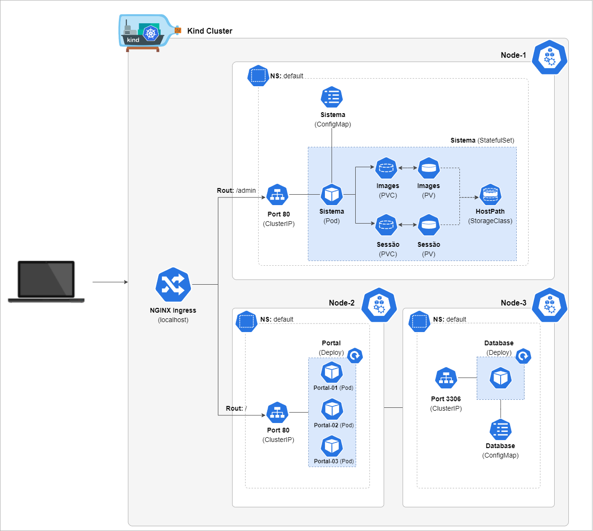

# Local Kubernetes Cluster with Kind

This repository presents a simple microservices project for recording and consuming news delivered in a Kubernetes environment. The idea is to build a local Kubernetes Cluster using the Kind tool and make the services (system, portal and database) available on different nodes through Node Affinity.

### Cluster Components

 

### Requirements
* Make
* Docker
* Kubernetes
* Kind

### Skeleton
```
├── /app
|   ├── /cluster
|   ├── /ingress
|   ├── /microservices
|   |   ├── /database
|   |   ├── /portal
|   |   ├── /system
|   |   |   ├── /pvc
├── /images
├── Makefile
```

### How to Run:
* In the root directory of the repository, run the following command in the terminal:
```
$ make
```
* If you want clean your environment run:
```
$ make clean
```
Note: You can individually create the cluster and each of its components. Just run the make command with the following parameters: cluster, database, system, portal or ingress. But keep in mind that some components have dependencies.

With cluster up you can access the system to create new news and consult them through the portal. 

* In your browser access the portal through follwing URL:
```
localhost/
```
* In your browser access the system through follwing URL:
```
localhost/admin
```
* System login:
```
usuário: admin
senha: admin
```